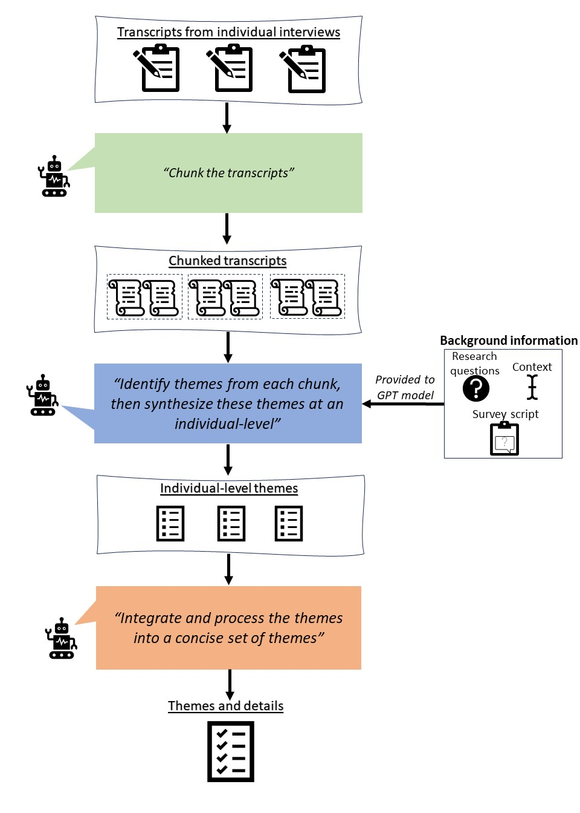

# GPT4QualititativeAnalysis Documentation

GPT4QualitativeAnalysis is a package that allows you to perform qualitative analysis using OpenAI's GPT models in an efficient and quick manner. 


* This package could read transcripts of any content type (ie PDF, word docx, txt files)! All you have to do is specify the folder in which your transcripts are stored in your local computer. 
* This package could read extensive amounts of transcripts (limited by your OpenAI API budget limit) and provide succint and reliable themes!
* Each theme comes in the form of a topic sentence, a detailed explaination and a relevant quote from the transcript, just like any other high level qualitative study!

## Requirements
### Required packages
The following packages are required to use this package:  
- `openai`   
- `docx`  
- `tqdm`  
- `nltk`  
- `python-docx`
- `textract`

If you do not have this packages installed in python, you can do the following 
```bash
pip install openai docx tqdm nltk python-docx textract
```
### OpenAI API key
You also need an OpenAI key to be able to use this package. If you do not have one, you can apply for an OpenAI API key at [platform.openai.com/api-keys](https://platform.openai.com/api-keys). 


## Installation
To install in python, simply do the following: 

```bash
pip install GPT4QualititativeAnalysis
```

## Quick Start
Here we provide a quick example on how you can execute GPT4QualitativeAnalysis to conveniently perform qualitative analysis from your transcript. For details towards each of the package's functions and parameters, refer to the [documentation](documentation.md). 

```python
from GPT4QualititativeAnalysis import *

# specify the context of your study
context = (
    "Physical inactivity is a major risk factor for developing several chronic illness. "
    "However, university students and staff in the UK are found to be more physically inactive "
    "compared the general UK population. "
    )
# specify your research questions
research_questions = (
    "This study seeks to understand the barriers and enablers "
    "of physical activity (PA) among university staff and students in "
    "the UK under the university setting, using the Theoretical "
    "Domain Framework (TDF) to guide the investigation. "
    )
# specify your survey script
survey_script = (
    "Knowledge\n "
    "What do you know about physical activity? How might you define physical activity? "
    "... ..."
    "... ..." # truncated to save space
    )


# Specify the folders containing your transcript
directory_path = "my_transcript_folder"
# specify your OpenAI API key
api_key = "<insert your API key>"
# specify the folder you wish to save your themes. 
save_results_path = "folder_of_my_saved_results"


# Analyze and synthesize transcripts
initial_themes, individual_synthesized_themes, overall_synthesized_themes = \
analyze_and_synthesize_transcripts(
    directory_path = directory_path, context = context,
    research_questions = research_questions, script = survey_script,
    api_key = api_key, save_results_path = save_results_path)


# optional (load your saved themes)
overall_synthesized_themes = load_results_from_json(
    os.path.join(save_results_path, "themes_overall.json"))

# view the relevant themes and 
print(overall_synthesized_themes)
```

## How does it work?

##### 1. Chunking 
Transcripts are chunked into sizeable bits to fit into GPT-4's context window
##### 2. Extracting relevant themes 
Background information is provided to the GPT model. These include the context, research question and survey script. Themes are then identified at a chunk-level. 
##### 3. Synthesizing themes at a participant level
Chunk level themes are then synthesized at a participant-level. 
##### 4. Synthesizing themes to a study-level
Participant-level themes are then synthesized at a study-level. For each study, the package returns a topic sentence of the theme, an explaination of the theme, and a supporting relevant quote from the transcript. 


